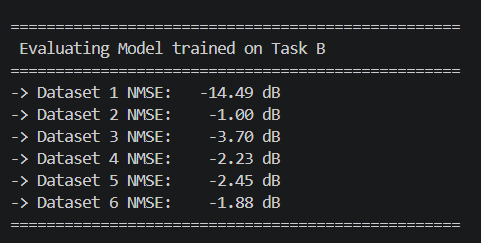
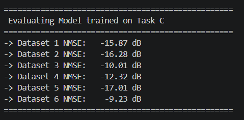

# CsiNet: CSI Compression and Generalization Analysis

This repository contains the implementation and analysis for **Exercise 2.15**, focusing on the compression and reconstruction of Channel State Information (CSI) using a deep learning autoencoder (CsiNet). 

The primary goal of this project is to evaluate the **generalization capabilities** and **robustness** of CsiNet across various spatial user distributions in an indoor wireless environment (simulated via the COST 2100 channel model).

## Project Overview

In massive MIMO systems, feeding back CSI to the base station requires massive bandwidth. CsiNet compresses this data into a lower-dimensional codeword and reconstructs it. This project investigates two training paradigms:
* **Task (b) - Environment-Specific Training:** Training the model solely on a base user distribution to observe its vulnerability and generalization failure when deployed in unseen environments (e.g., hotspots, edges).
* **Task (c) - Mixed Training:** Training the model on a diverse dataset containing multiple spatial distributions to significantly enhance its physical robustness and generalization capability.

## 📂 Repository Structure
```text
├── README.md                  # Project documentation
├── .gitignore                 # Specifies intentionally untracked files to ignore
├── requirements.txt           # Python dependencies
├── Generate_CsiNet_Data.m     # MATLAB script to generate COST2100 channel data
├── CsiNet_train.py            # Main training script (Supports Task B & C)
├── CsiNet_onlytest.py         # Inference and evaluation script
├── data/                      # Directory for dataset .mat files (Not included due to size constraints)
├── result/                    # Directory for TensorBoard logs, loss CSVs, and model architectures
└── saved_model/               # Directory for trained .h5 weights (Not included due to size constraints)
```

*Note: The generated `.mat` datasets and trained `.h5` model weights are excluded from this repository to comply with GitHub's file size limits. Instructions to generate them locally are provided below.*

## Prerequisites and Setup

1. **Python Environment:** Ensure you have Python 3.8+ installed.
2. **Install Dependencies:**
   ```bash
   pip install -r requirements.txt
   ```
   *(Main dependencies include `tensorflow`, `scipy`, `numpy`, and `matplotlib`)*
3. **MATLAB:** Required only for generating the initial COST 2100 datasets.

## Usage Instructions

### Step 1: Data Generation
Since the dataset files are too large to host on GitHub, you must generate them locally.
1. Open MATLAB.
2. Run the `Generate_CsiNet_Data.m` script.
3. The script will simulate the `Indoor_CloselySpacedUser_2_6GHz` environment and automatically output 6 different `.mat` files into the `data/` directory representing different spatial user distributions (Base, X-shifted, Y-shifted, Expanded, Contracted, and Random).

### Step 2: Model Training
The training script supports both single-dataset training and mixed-dataset training.
1. Open `CsiNet_train.py`.
2. Configure the `TASK_MODE` variable:
   * Set `TASK_MODE = 'B'` to train only on Dataset 1 (Baseline).
   * Set `TASK_MODE = 'C'` to train on all 6 datasets simultaneously (Mixed Training).
3. Run the training script:
   ```bash
   python CsiNet_train.py
   ```
   The script will save the model architecture (`.json`), weights (`.h5`), and the normalization factor (`_max_abs.npy`) into the `result/` directory.

### Step 3: Evaluation and Inference
Evaluate the trained models to calculate the Normalized Mean Square Error (NMSE) across all 6 datasets.
1. Open `CsiNet_onlytest.py`.
2. Set the `EVALUATE_MODEL_TASK` variable to match the model you wish to test (`'B'` or `'C'`).
3. Run the evaluation script:
   ```bash
   python CsiNet_onlytest.py
   ```
   The script will perform inference, reverse the normalization to the physical complex domain, and output the exact NMSE (in dB) for each spatial scenario.

## Key Findings

* **Baseline Vulnerability:** Models trained exclusively on a single spatial distribution overfit to that specific geometry. When tested on shifted or scaled user distributions, the NMSE degrades catastrophically (e.g., dropping from -14 dB to -1 dB).



* **Robustness via Spatial Diversity:** By utilizing a mixed training strategy (Task C) across varied user distributions, the model learns the fundamental multipath properties of the environment. This recovers the performance in extreme scenarios (improving to -10 dB ~ -17 dB) without sacrificing performance on the base distribution.

