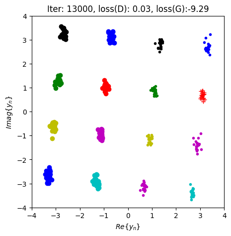
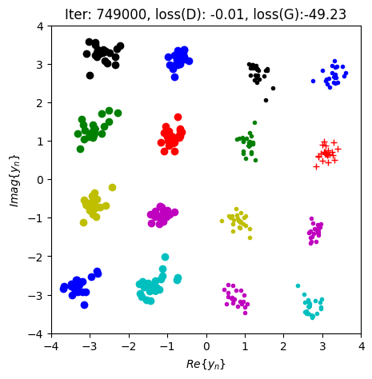

# Rayleigh Channel Simulation using Conditional GAN (CGAN)

## Overview
This repository contains the implementation of a Conditional Generative Adversarial Network (CGAN) designed to simulate a Rayleigh fading channel. The model learns the distribution of the received signals (16-QAM) under Rayleigh fading and Additive White Gaussian Noise (AWGN) without relying on an explicit mathematical channel equation during generation.

## Methodology
* **Simulating the Physical Environment ($y = hx + n$):**
To train the Conditional GAN, the Generator needs a ground truth to mimic. By programming the exact physical equation $y = hx + n$, we provide the Discriminator with perfect samples of how a 16-QAM signal behaves under Rayleigh fading. The Generator is then forced to learn this physical mapping blindly, using only the latent noise and the conditioning vector.

* **Solving the "Deep Fade" Collapse:**
Before applying the normalization fix, the generated constellation completely collapsed into a single noisy point at the origin $(0, 0)$. Because the raw channel coefficients $|h|$ were extremely small, the signal energy $hx$ approached zero, leaving nothing but the AWGN ($n$). This is physically equivalent to a severe "Deep Fade," causing a near-zero Signal-to-Noise Ratio (SNR). By normalizing the channel dataset to have an average power of 1 ($E[|h|^2] = 1$), the signal energy was restored, allowing the 16-QAM constellation to spread out properly across the $[-4, 4]$ coordinate plane.

* **Conditioning Vector Normalization:**
Dividing the conditioning vector by $3.0$ ensures that the input features fed into the Generator and Discriminator fall within a standard range (roughly $[-1, 1]$). Since the maximum amplitude of a 16-QAM symbol is $3+3j$, this scaling prevents gradient explosion and stabilizes the GAN's training dynamics.

## Modifications
1. **Completion of Data Preparation Function:**
The core task was to complete the `generate_real_samples_with_labels_Rayleigh` function. The implemented logic follows the physical communication model $y = hx + n$:
    * **Channel & Symbol Generation:** Randomly sampled channel coefficients $h$ from the dataset and generated 16-QAM symbols $x$.
    * **AWGN Addition:** Simulated the received signal by applying the channel fading and adding Gaussian noise with a variance of $0.03$.
    * **Conditioning Vector:** Constructed the conditioning vector by concatenating the real and imaginary parts of both the transmitted symbol and the channel $[\text{Re}(x), \text{Im}(x), \text{Re}(h), \text{Im}(h)]$. The vector was normalized by $3.0$ (the maximum amplitude of 16-QAM) to stabilize the GAN training.
2. **Channel Normalization:** 
 introduced a mathematical normalization step before training to restore the average channel power to 1 ($E[|h|^2] = 1$).
``` py
h_dataset = h_dataset / np.sqrt(np.mean(np.abs(h_dataset)**2))
```

## Results & Analysis
### 1. Image Comparison: 
| Early Stage (Iteration 16000) | Converged Stage (Iteration 748000) |
| :---: | :---: |
|  |  |
| Point clusters are too dense. | Points show natural variance. |


* **Early Stage:** The Generator learns the mathematical mean of the target distribution (the $hx$ position) but completely fails to model the physical variance of the noise. Consequently, the generated colored points are far too clustered and perfect.
* **Converged Stage:** Forced by the Discriminator, the Generator eventually learns the complex distribution of the Gaussian noise. The colored points exhibit a natural, circular dispersion that successfully simulating the wireless environment.

### 2. WGAN-GP Loss Interpretation
At the later stages of training, the observed loss metrics were loss(D) ≈ -0.01 and loss(G) ≈ -49.23.
* Because this model uses a Wasserstein GAN with Gradient Penalty, the Discriminator outputs a "realness score" rather than a probability.

* The massive negative Generator loss means the Discriminator assigned an extremely high score to the fake signals.

* The near-zero Discriminator loss indicates that the Discriminator can no longer tell the difference between the true channel data and the CGAN-generated data.

### Conclusion 
The model has successfully reached Nash Equilibrium, proving that the CGAN has fully mastered the Rayleigh fading distribution.

## 📂 Repository Structure
```text
Wireless_AI/QuaDRiGa/
├── main.py     # Main Python script (Modified & Completed)
├── requirements.txt            # Python dependencies
├── .gitignore                  # Git ignore rules for clean repository
├── ChannelGAN_Rayleigh_images/ # Generated constellation plots
│   ├── step_16000.png          # Image showing early training stage
│   └── step_748000.png         # Image showing converged training stage
└── README.md                   # Project documentation
```

## How to Run
```
python main.py
```
### Observing Terminal Output:
After launching the script, you will see terminal outputs similar to the following:
* succeeded in loading checkpoint... (If historical checkpoints exist, it will automatically load them and resume)
* No checkpoint found, will start training from scratch. (If running for the very first time)

Subsequently, it will print Start Plotting at regular intervals.


