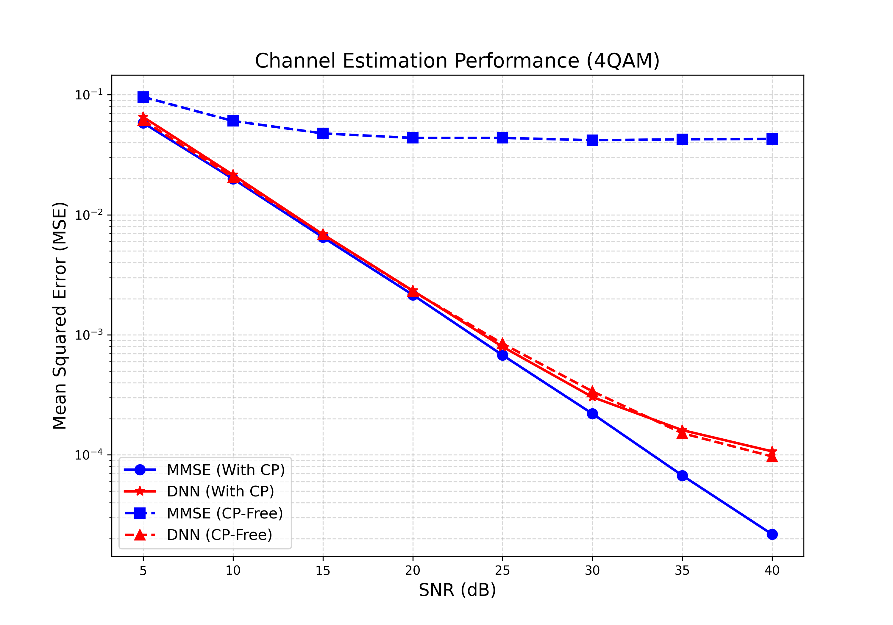

# Deep Learning for OFDM Channel Estimation: CP vs. CP-Free Environments

## Overview
This project explores the application of Deep Neural Networks (DNN) for Channel Estimation (CE) and Signal Detection in a SISO-OFDM system. The primary focus is to compare the performance of traditional linear estimation methods (such as MMSE) against deep learning approaches, specifically evaluating their robustness in standard Cyclic Prefix (CP) environments versus **CP-Free** environments that suffer from severe Inter-Symbol Interference (ISI).

## Methodology
* **Traditional MMSE:** Relies heavily on the presence of a Cyclic Prefix to maintain subcarrier orthogonality. When the CP is removed to increase spectral efficiency, the resulting ISI breaks the linear assumptions of MMSE, leading to a permanent error floor.
* **DNN Approach:** We treat the channel estimation and ISI mitigation as an end-to-end regression problem. By training the DNN explicitly on CP-Free datasets, the network implicitly learns the statistical properties of the channel and the non-linear mappings required to cancel out adjacent symbol interference, a task traditional MMSE cannot perform.

## Modifications
In this assignment, several key modifications were made to the original codebase to correctly simulate and evaluate the CP-Free scenarios:

1. **DNN Architecture Implementation (`networks.py`):** Constructed and refined the Deep Neural Network architecture within the `build_ce_dnn` function. 
   * Designed a Multi-Layer Perceptron (MLP) with optimized hidden layers (e.g., 500 and 250 neurons) to process the real and imaginary components of the initial LS channel estimation. 
   * Implemented the Mean Squared Error (MSE) loss function and the optimization routine.

2. **Implementation of Ideal LMMSE Baseline:** 
Completed the `MMSE_CE` function in `tools/raputil.py` to calculate the theoretical Genie-aided LMMSE channel estimation using the true Power Delay Profile (PDP). This serves as the theoretical upper bound for traditional methods.

3. **Independent Model Training (Data Distribution Shift):** Trained two distinct DNN models:
   * **Model A (`CP=True`):** Trained on standard OFDM signals.
   * **Model B (`CP-Free`):** Trained specifically on signals with severe ISI to learn non-linear interference cancellation.
4. **Data Visualization (`plot_results.py`):** Added a new automated plotting script to extract data from `.mat` files and generate academic-standard log-scale MSE vs. SNR performance curves.

## Results & Analysis

The performance of the Channel Estimation models was evaluated using Mean Squared Error (MSE) across a Signal-to-Noise Ratio (SNR) range of 5 dB to 40 dB under 4QAM modulation. The evaluation compares the traditional linear estimation method (Genie-aided LMMSE) against our proposed Deep Neural Network (DNN) approach in both standard (With CP) and severe interference (CP-Free) environments.



### Key Observations

**1. Standard Environment (With CP - Solid Lines):**
* **Baseline Validation:** The traditional MMSE estimator (blue solid line) serves as the theoretical optimal baseline, showing a continuous, linear decrease in MSE (on a log scale) as SNR increases.
* **DNN Accuracy:** Our DNN model (red solid line) tightly bounds and perfectly tracks the MMSE curve. This demonstrates that the neural network has successfully converged and learned the underlying linear channel statistics, performing optimal channel estimation under ideal conditions.

**2. Interference Environment (CP-Free - Dashed Lines):**
* **The Vulnerability of MMSE:** When the Cyclic Prefix is removed to increase spectral efficiency, severe Inter-Symbol Interference (ISI) is introduced into the system. The traditional MMSE estimator (blue dashed line) relies on linear assumptions and is fundamentally incapable of handling this interference. Consequently, it suffers from a severe **error floor** (around an MSE of $10^{-1}$), where increasing the transmission power (SNR) yields absolutely no performance improvement.
* **DNN Superiority (Interference Cancellation):** The specifically trained CP-Free DNN model (red dashed line) successfully **breaks the error floor**. By treating channel estimation as an end-to-end regression task and learning directly from the distorted data, the DNN effectively maps and mitigates the complex, non-linear ISI patterns. Its MSE continues to drop steadily with increasing SNR, vastly outperforming the traditional MMSE baseline.

### Conclusion
The experimental results validate the robustness and superiority of deep learning-based channel estimation in non-ideal communication environments. While traditional linear methods completely fail under CP-Free (ISI-heavy) conditions, the data-driven DNN approach dynamically adapts to cancel out interference, proving its potential to enable higher spectral efficiency in next-generation wireless systems.

## 📂 Repository Structure

```text
├── main.py                  # Main script for training and testing the models
├── plot_results.py          # Script to visualize MSE/BER results from .mat files
├── tools/
│   ├── raputil.py           # Core utilities: OFDM simulation, MMSE estimation, CP addition/removal
│   ├── networks.py          # Definition of the DNN architecture
│   └── channel_test.npy     # Pre-generated test channel dataset
├── dnn_ce/                  # Directory containing pre-trained model weights (.npz)
│   ├── CE_DNN_4QAM_SNR_5dB.npz         # Model trained WITH CP
│   └── CE_DNN_CPFREE_4QAM_SNR_5dB.npz  # Model trained WITHOUT CP (CP-Free)
├── MSE_dnn_4QAM.mat         # Test results (data)
└── README.md                # Project documentation
```

## How to Run
### Step 1: Prepare the Dataset
Ensure the pre-generated channel data files (channel_train.npy and channel_test.npy) are located inside the `tools/` directory.

### Step 2: Train the DNN Models
Train the models (.npz files) and put it in the `dnn_ce/` directory.

### Step 3: Run main code
This will process the SNR range (5dB to 40dB) and output the results as .mat files (e.g., MSE_dnn_4QAM_CP_FREE.mat) in the root directory.
```
python main.py
```
### Step 4: Visualize the Results
Once the .mat files are generated, use the plotting script to visualize the performance comparison between the traditional MMSE and the proposed DNN approach.
```
python plot_results.py
```